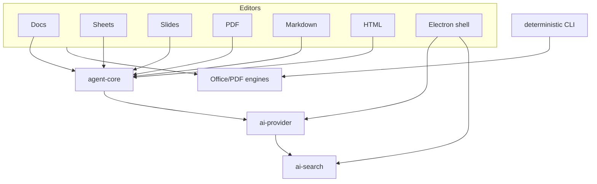

# AI removal plan

This repository is currently an Electron monorepo with six editor applications
(`docs`, `sheets`, `slides`, `pdf`, `markdown`, and `html`) plus the `shell` and
the deterministic `@genoffice/cli` package. It uses npm workspaces and a
checked-in `package-lock.json`.

## Audit summary

### Keep

- `packages/docx-engine`, `pptx-engine`, `pptx-ops`, `pptx-render`,
  `xlsx-gateway`, `pdf2docx`, `html2docx`, `zip-gate`, `font-metrics`, and
  `electron-utils`.
- `packages/file-parse`: despite its original attachment-oriented description,
  it parses DOCX, XLSX, PPTX, PDF, and text formats and is reusable for local
  inspection and deterministic local search.
- `packages/project-store`, `pipelines`, `ui`, `i18n`, and the filesystem,
  open/save, export, print, and window-management IPC.
- The deterministic document commands in `packages/cli` (conversion,
  inspection, rendering, and file operations).

### Remove

- `packages/agent-core`: agent loop, skills, tool execution, and streaming
  transport.
- `packages/ai-provider`: provider registry, model configuration, streaming,
  image/media generation, and Codex app-server integration.
- `packages/ai-search`: Genspark authentication, web/image search, media
  analysis, and remote reranking.
- AI-only CLI commands (`search`, `image`, `media`, `cloud`, and capability
  reporting that exposes providers), MCP/agent-install integrations, and their
  settings and preload APIs.
- AI panels, Ask AI popovers, generation actions, AI-only keyboard shortcuts,
  and AI settings from every editor. Ordinary ribbons and editors remain.

### Refactor

- Each editor renderer `App.tsx` currently combines document state with AI
  state. Remove only AI state/effects/handlers and the AI dock; retain the
  document lifecycle, editing commands, formatting, images, tables, formulas,
  shapes, save/export, and print paths.
- Each app's `shared/ipc.ts`, preload, and main process files mix filesystem
  IPC with AI settings/streaming. Delete AI channels and handlers while keeping
  file, conversion, render, index, and window channels.
- `packages/cli` should retain deterministic commands but no longer depend on
  `@modelcontextprotocol/sdk`, agent packages, or remote search/media code.
- `packages/ui` should retain general editor UI primitives while removing
  `AiComposer`, `AiPanelSideButton`, AI preferences, and AI-only strings.

### Investigate before deletion

| Area | Direct consumers | Decision |
| --- | --- | --- |
| `file-parse` | editor/main and CLI-adjacent parsing paths | Keep and rename/document its local inspection role. |
| `project-store` | shell and editor persistence | Keep; remove chat-specific tables and APIs only after callers are migrated. |
| `apps/shell/src/main/file-index` | local file indexing | Keep deterministic/local; remove any model/reranker branch. |
| `apps/shell/src/main/mcp` | shell and CLI | Remove because its purpose is agent integration, not local Office use. |
| `ee/` and packaging | release/build configuration | Inspect licensing and remove only unused enterprise references. |

## Current dependency shape

## Safest removal order

1. Remove AI controls and callers from renderer entry points, then typecheck.
2. Remove AI IPC handlers and preload exposure, then typecheck/build each app.
3. Remove AI settings/authentication/cloud project code from the shell.
4. Remove AI-only CLI commands and MCP/agent integrations.
5. Remove workspace references and delete `agent-core`, `ai-provider`, and
   `ai-search`; regenerate the npm lockfile with `npm install`.
6. Replace any optional search reranker with deterministic local search and
   document all remaining network destinations.
7. Run Office engine tests and editor builds; record unrelated upstream failures.

## Baseline (2026-10-07, Asia/Jakarta)

- Package manager: npm workspaces; lockfile: `package-lock.json`.
- `node_modules` was initially absent. `npm run typecheck` therefore stopped
  in `@genoffice/i18n` with missing `vitest`/`vitest/config` declarations.
- `npm install` was attempted from the lockfile. It did not complete because
  Windows returned `EPERM` while npm was creating nested Electron dependency
  directories (`node_modules/app-builder-lib/node_modules/@electron`). The
  lockfile was not manually edited.
- A clean post-install typecheck/build result is therefore not yet available.

## Acceptance criteria

- No editor or shell UI exposes AI panels, prompts, providers, models, API-key
  fields, cloud authentication, generation, or remote search.
- Local open/edit/save/export/print works offline for DOCX, XLSX, PPTX, PDF,
  Markdown, and HTML.
- No source import, workspace dependency, IPC channel, preload API, environment
  variable, or network destination exists solely for AI functionality.
- Remaining external network calls are listed in `NETWORK_AUDIT.md` and none
  transmit document content to an AI service.

## Progress

- Removed the shell file-search decision-model/reranker implementation,
  including its remote and local endpoint clients, persisted settings, IPC
  channels, settings controls, UI badge, and tests. The shell now presents the
  deterministic local index order directly.
- Removed shell cloud-project browsing, Genspark account/login/credit IPC,
  provider/media preload APIs, agent-integration UI/IPC, and the associated
  provider settings modal. The shell's settings modal now contains only local
  language, theme, document-theme, save-location, and version information.
